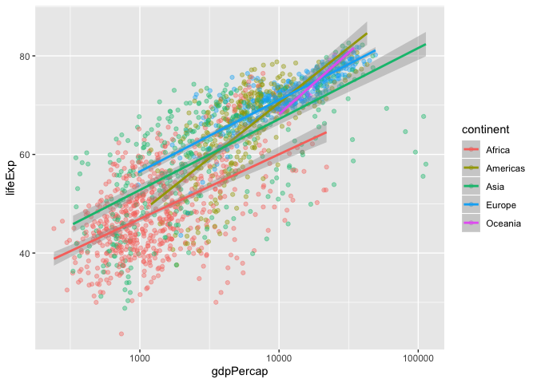

## Chip Galusha’s Class One Participation Document

### Intro To ggPlot2

### Grammar of Graphics

ggplot2 implements the grammar of graphics - a coherent system for
describing & building graphs.

  - Good grammar \> 1st step for a good sentence  
  - Good graphical grammar \> 1st step in a well formed or correct
    graphic

*ggplot2 builds up a graphic from multiple layers of data*

**Components of the Layered Gramnmar**  
\* data & aestedic mapping  
\* geometric objects  
\* scales \* facet specification \* statistical transformation  
\* the coordinate system

A layered grammar defines the components of a plot as:  
\* A default dataset \> mapping variables to aestedices \* One or more
layer w/: - one geometric object  
\- one statistical transformation - one position adjustment  
\- and optionally a data set and aesdetic mapping \* one scale for each
aestedic mapping  
\* a coordinate system  
\* a facet specification

``` r
#install.packages("gapminder")
library(gapminder)
library(tidyverse)
```

    ## ── Attaching packages ─────────────────────────────────────────────────────── tidyverse 1.2.1 ──

    ## ✔ ggplot2 3.2.1     ✔ purrr   0.3.3
    ## ✔ tibble  2.1.3     ✔ dplyr   0.8.3
    ## ✔ tidyr   1.0.0     ✔ stringr 1.4.0
    ## ✔ readr   1.3.1     ✔ forcats 0.4.0

    ## ── Conflicts ────────────────────────────────────────────────────────── tidyverse_conflicts() ──
    ## ✖ dplyr::filter() masks stats::filter()
    ## ✖ dplyr::lag()    masks stats::lag()

``` r
library(ggthemes)
library(wesanderson)
```

Let’s get the data ready

``` r
data("gapminder")

str(gapminder)
```

    ## Classes 'tbl_df', 'tbl' and 'data.frame':    1704 obs. of  6 variables:
    ##  $ country  : Factor w/ 142 levels "Afghanistan",..: 1 1 1 1 1 1 1 1 1 1 ...
    ##  $ continent: Factor w/ 5 levels "Africa","Americas",..: 3 3 3 3 3 3 3 3 3 3 ...
    ##  $ year     : int  1952 1957 1962 1967 1972 1977 1982 1987 1992 1997 ...
    ##  $ lifeExp  : num  28.8 30.3 32 34 36.1 ...
    ##  $ pop      : int  8425333 9240934 10267083 11537966 13079460 14880372 12881816 13867957 16317921 22227415 ...
    ##  $ gdpPercap: num  779 821 853 836 740 ...

``` r
ggplot(data = gapminder, mapping = aes(x = year, y = pop, color = continent)) +
  geom_point()
```

<!-- -->

Aggregate by continent.

``` r
gapminder %>% 
  group_by(year, continent) %>% 
  summarise(pop = sum(pop)) %>% 
ggplot(data = ., mapping = aes(x = year, y = pop, color = continent)) +
  geom_point() +
  scale_y_log10()
```

    ## Warning in summarise_impl(.data, dots, environment(), caller_env()):
    ## integer overflow - use sum(as.numeric(.))
    
    ## Warning in summarise_impl(.data, dots, environment(), caller_env()):
    ## integer overflow - use sum(as.numeric(.))
    
    ## Warning in summarise_impl(.data, dots, environment(), caller_env()):
    ## integer overflow - use sum(as.numeric(.))
    
    ## Warning in summarise_impl(.data, dots, environment(), caller_env()):
    ## integer overflow - use sum(as.numeric(.))
    
    ## Warning in summarise_impl(.data, dots, environment(), caller_env()):
    ## integer overflow - use sum(as.numeric(.))
    
    ## Warning in summarise_impl(.data, dots, environment(), caller_env()):
    ## integer overflow - use sum(as.numeric(.))
    
    ## Warning in summarise_impl(.data, dots, environment(), caller_env()):
    ## integer overflow - use sum(as.numeric(.))
    
    ## Warning in summarise_impl(.data, dots, environment(), caller_env()):
    ## integer overflow - use sum(as.numeric(.))

    ## Warning: Removed 8 rows containing missing values (geom_point).

<!-- -->

``` r
gapminder %>% 
  filter(continent == "Asia") %>% 
ggplot(data = ., mapping = aes(x = year, y = gdpPercap, color = country)) +
  geom_point() +
  facet_wrap(~continent)
```

<!-- -->

Try two numeric
values.

``` r
ggplot(data = gapminder, aes(x = gdpPercap, y = lifeExp, color = continent, size = pop)) +
  geom_point() +
  scale_x_log10() +
  stat_smooth(method = "lm")
```

<!-- -->

Changing mapping for population.

``` r
# this is useless but it shows how shape works
gapminder %>% 
  filter(continent == "Europe") %>%
  group_by(country) %>% 
  summarise(gdpPercap = mean(gdpPercap),
            lifeExp = mean(lifeExp)) %>% 
ggplot(data = ., mapping = aes(x = gdpPercap, y = lifeExp, shape = country)) +
  geom_point() +
  scale_x_log10() +
  stat_smooth(method = "lm")
```

    ## Warning: The shape palette can deal with a maximum of 6 discrete values
    ## because more than 6 becomes difficult to discriminate; you have
    ## 30. Consider specifying shapes manually if you must have them.

    ## Warning: Removed 24 rows containing missing values (geom_point).

<!-- -->

Back to square one.

``` r
ggplot(data = gapminder, mapping = aes(x = gdpPercap, y = lifeExp)) +
  geom_point(aes(color = continent), alpha = .4) +
  scale_x_log10() +
  stat_smooth(method = "lm", mapping = aes(color = continent))
```

<!-- -->

``` r
ggplot(data = gapminder, mapping = aes(x = gdpPercap, y = lifeExp)) +
  geom_point(alpha = .4) +
  scale_x_log10() +
  stat_smooth(method = "lm") +
  facet_wrap(~continent) +
  xlab("GDP per Capita") +
  ylab("Life Expectancy") +
  ggtitle("Life Expectancy By GDP per Capita", subtitle = " Faceted By Continent") 
```

<!-- -->

Getting weird again

``` r
gapminder %>% 
ggplot(data = ., mapping = aes(x = continent, y = lifeExp)) +
  stat_summary(fun.ymin = min,
               fun.ymax = max, 
               fun.y = median, 
               alpha = .9) +
  geom_point() +
  coord_flip() +
  theme_fivethirtyeight()
```

<!-- -->
